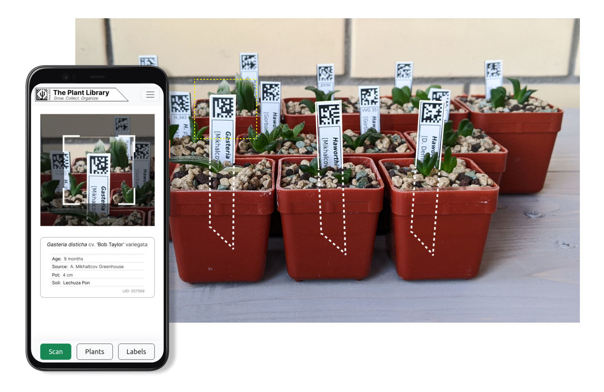

# `Plant Lib` 🌵 
The Plant Lib web app, a simple and easy-to-use tool that helps identify plants by scanning a data matrix code on the label. With this app, you can quickly and easily access detailed information about a the plants, including their common and scientific names, age, seed source, and more. Whether you're a gardener, botanist, or just someone who loves plants, this app is the perfect way to stay informed and stay connected with your plants. 

This project is related to another one: [Plants Data Organizer](https://github.com/Square-Pot/Plants-Data-Organizer) offline application for desktop. While the desktop app is still available for use, I'm in the process of migrating its features to this web version. 

## Built with:
- [Vue.js 3](https://vuejs.org/) as a frontend framework
- [html5-qrcode](https://github.com/mebjas/html5-qrcode ) library for QR code scanning
- [Django](https://www.djangoproject.com/) and [Django REST framework](https://www.django-rest-framework.org/) as a backend framework
- [PostgreSQL](https://www.postgresql.org/) as a data storage
- [Nginx](https://www.nginx.com/) as a web server
- [Docker Compose](https://docs.docker.com/compose/) for orchestration

## Usage:
For deploy use `docker compose` after changing credentials.  
For end user The Plant Lib app is designed to be simple and easy to use. All you need is a browser on a desktop or mobile device and access to the camera. No additional software is required.

## Demo:
Want to see `Plant Lib` app in action? Check out our working prototype by clicking on this link: [galangal.ru](https://galangal.ru). As an example, you can use the data matrix code shown in the screenshot above to test the app. Keep in mind that this is a prototype and some features may not be fully functional yet.

## Contribution:
I welcome any contributions. If you have an idea for a new feature or have found a bug, please feel free to open an issue on our GitHub repository. I'll be happy to hear your feedback and suggestions.
