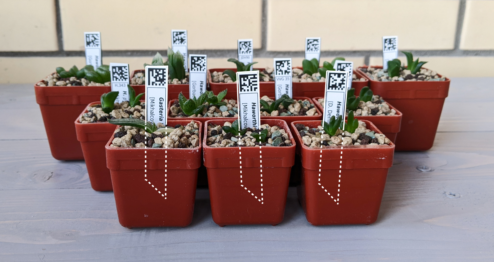

# `Plant Lib` 🌵 
Web application for identificaton your plants by Data Matrix powered by Django and Vue.js

This project is related to another one: [Plants Data Organizer](https://github.com/Square-Pot/Plants-Data-Organizer) offline application for desktop. 

## Working porotype
Working prototype is available now here:  [galangal.ru](https://galangal.ru)